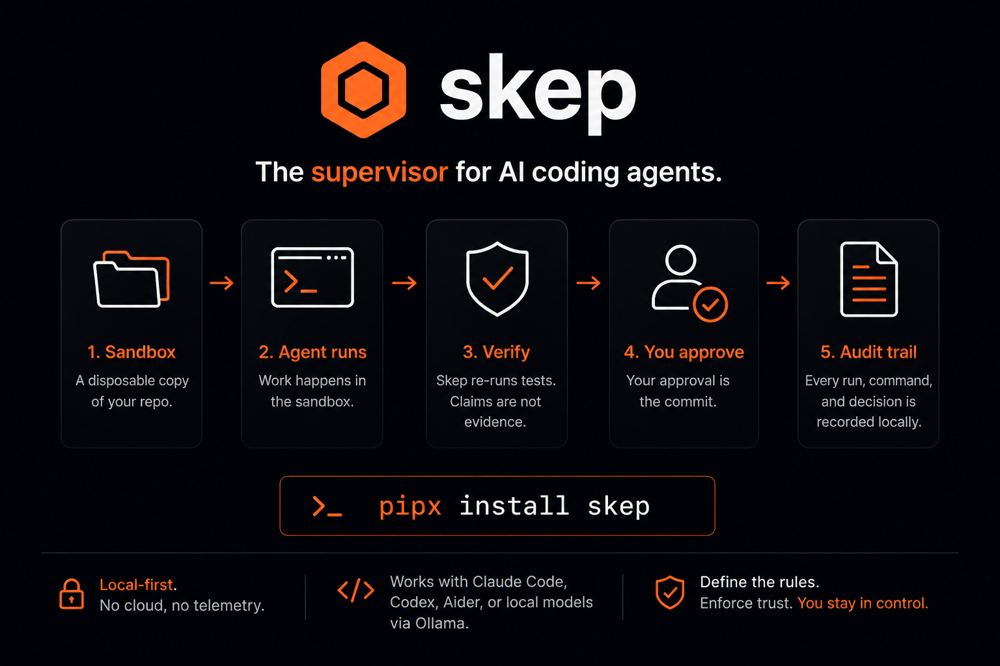
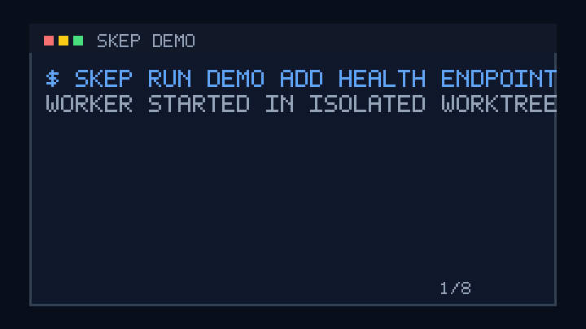

# skep

**Govern your AI coding agent. Sandbox it, verify its work, approve before it lands.**

[](https://pypi.org/project/skep/)
[](https://pypi.org/project/skep/)
[](LICENSE)



skep is a local-first supervisor for AI coding agents — Claude Code, Codex,
Aider, a local model via Ollama, or its own built-in worker. Every agent works
behind a contract: sandboxed execution in a disposable worktree, independent
re-verification of whatever the agent claims, and a patch that reaches your
repository only when you approve it. It is v1, single-operator by design, and
has been daily-driven in the field since mid-July 2026.



**Contents:** [Why](#why-skep-exists) · [How a run flows](#how-a-run-flows) ·
[Install](#install) · [Quickstart](#60-second-quickstart) ·
[Security model](#the-security-model) · [Workers](#workers) ·
[Local models](#local-models-and-the-brain-dial) ·
[Beyond the patch](#beyond-the-patch) · [Command deck](#the-command-deck) ·
[Messengers](#messenger-channels) · [Status](#status) ·
[Honest limits](#honest-limits) · [Comparison](#how-skep-compares) ·
[Docs](#documentation) · [Contributing](#contributing)

## Why skep exists

Raw coding agents move fast, and wide. They are genuinely productive — and
they can also:

- **Mutate repos directly.** An agent can edit, commit, or push before you
  have read a single line of the actual diff.
- **Run broad commands.** Package installs, arbitrary shell, and outbound
  network calls happen without an explicit boundary.
- **Overstate verification.** "Tests passed" from the same process that wrote
  the code is not an independent check. A model saying it is a sentence, not
  a proof.

skep's answer is not a smarter agent. It is a control plane: the agent stays
exactly as capable as before, but every capability runs behind a contract you
define once and the system enforces every time.

## How a run flows

```
1. WORKER STARTED       agent dispatched into an isolated git worktree
2. FILES CHANGED        edits + shell commands stream as durable events
3. WORKER CLAIM         "tests passing" — recorded, not believed
4. INDEPENDENT VERIFY   skep replays the patch on a clean copy and
                        re-runs the pinned verify command itself
5. PATCH READY          evidence + diff await your approval;
                        approval lands on branch skep/<task_id>, never main
```

Two independent results must agree before a run is confirmed: the worker said
*passed*, and skep's own replay said *passed*. Either one alone is not enough.

## Install

```sh
pipx install skep
```

Or `uvx skep` to try it without installing. On Debian/Ubuntu and other
PEP 668 distros, the system Python refuses bare `pip install` with an
externally-managed-environment error — install skep as an app instead:
`sudo apt install pipx && pipx install skep`, then `pipx ensurepath`.
Inside a virtual environment, `pip install skep` works as ever. Please
don't reach for `--break-system-packages` — least privilege applies to
installers too.

From a checkout, `bash scripts/install.sh` detects the source tree and runs
`uv sync`. A `Dockerfile` and `docker-compose.yml` also ship in the repo
(`make image`) for containerized runs.

**Requirements:** Python 3.12+, macOS or Linux. Linux sandboxing needs
`bubblewrap` (`sudo dnf install bubblewrap` / `sudo apt install bubblewrap`);
macOS uses Seatbelt out of the box. All state lives locally under `~/.skep` —
no cloud, no account, no telemetry.

## 60-second quickstart

```sh
skep serve   # daemon + web UI at http://127.0.0.1:8765
skep chat    # the same conversation in your terminal
```

Tell the chat what repo to work on and what you want done — approvals,
cards, and live run events arrive inline. Or skip the conversation:

```sh
skep run /path/to/your-repo "fix the failing test" --execution-mode workspace
skep review <task_id>             # inspect the patch + evidence
skep review <task_id> --approve   # lands on branch skep/<task_id>, never main
```

The complete first-run path, worker setup, and sandbox notes are in
[`docs/quickstart.md`](docs/quickstart.md).

## The security model

The threat model is simple: **the agent is competent and untrusted.** It
never touches your repository directly. It works in an isolated git worktree,
produces a patch plus evidence, and the patch lands only through your
approval — landing IS the commit.

- **Sandbox.** macOS Seatbelt or Linux bubblewrap confines every worker;
  filesystem and network access are policy, not habit.
  ([`docs/sandboxing.md`](docs/sandboxing.md))
- **Verify.** skep re-runs the project's pinned verify command on a clean
  copy before you review — the worker's own claim is never the evidence.
  ([`docs/verification.md`](docs/verification.md))
- **Approve.** A patch, not a promise. Workers cannot push, pull, fetch, or
  switch branches; no permission grant overrides that.
  ([`docs/approvals.md`](docs/approvals.md))
- **Audit.** Every run, event, shell command, approval, and decision is a
  durable record you can inspect and replay later.

The non-negotiable rules behind all of this are written down in
[`docs/invariants.md`](docs/invariants.md) — that file is the part of the
project I most want challenged.

When a worker needs more permission than policy grants, skep stops at an
approval gate: approve once, deny, or approve-and-remember so similar future
runs move with less friction while the ledger still records everything.
Templates capture only the permissions that actually worked; the default
policy never widens on its own.

## Workers

| Worker | What it drives | Notes |
|---|---|---|
| Claude Code | Anthropic's CLI agent | adapter ships in the box |
| Codex | OpenAI's CLI agent | adapter ships in the box |
| Aider | Aider | adapter ships in the box |
| Built-in | skep's own worker | no external CLI required |
| Ollama | any local model | fully offline if your models are |

All workers run under the same contract — same sandbox, same verification,
same approval gate. The adapter surface for bringing your own worker is in
[`docs/workers.md`](docs/workers.md).

## Local models and the brain dial

The chat "Queen" that plans and dispatches work is deliberately tool-driven
rather than cleverness-driven, so it ships tuned for a small local model via
Ollama — and the model is a dial, not an identity. Three provider protocols
are supported: native Ollama, OpenAI-compatible endpoints, and the Anthropic
API ([`docs/brain.md`](docs/brain.md)). The entire core loop — plan,
dispatch, sandbox, verify, approve, audit — works without a cloud account.

## Beyond the patch

Coding runs are the spine, but skep is a full assistant living behind the
same gates:

- **Memory and notes.** Tell skep to remember a decision or a gotcha and it
  becomes durable, curated memory that grounds future work; lighter
  observations land in searchable notes. A vault bridge syncs notes into
  Obsidian as linked markdown — your knowledge graph, not a chat silo.
- **Skills.** Reusable procedures born from confirmed work and curated by
  the operator. skep never fetches skills from the internet or auto-imports
  community packs — skills are local, curated, and trusted. You decide what
  it knows.
- **Governed research.** Web research from allow-listed sources, with
  evidence per source and unreachable sources named explicitly.
- **Maintenance audits.** Bump unsafe dependency pins against an advisory
  set and re-run the suite — deterministic, LLM-free, offline.
- **MCP tools.** Register any MCP server and its tools run through the same
  policy layer and approval gates as skep's own. First-party mail and
  calendar MCP servers ship in the package
  ([`docs/assistant-tools.md`](docs/assistant-tools.md)).
- **Schedules and digests.** "Every morning at 9, review my repos for
  dependency drift" becomes a ticker with last-run/next-run state in the
  dashboard.

skep introduced these itself, in its own words, in a post published through
its own approval gate:
[*I'm Live — Come Build with Me*](https://anmolnoor.com/blog/skep-is-live).

## The command deck

The chat composer doubles as a deterministic command line: any message starting
with `/` is parsed by the UI and executed against the same HTTP API the buttons
use — the assistant's model never sees it. `/help` lists the deck; reads
(`/policy`, `/state`, `/runs`, `/approvals`, `/repos`) render immediately, and
mutations (`/setup`, `/workon`, `/phase`, `/land`, `/approve`, `/deny`,
`/schedule`) show the same confirmation card a model proposal would, audited
under actor `operator-command`. `/workon <path>` makes any local directory a
first-class workspace: a confirmed `git init` + baseline commit if needed, then
the same trusted-project setup a registered repo gets. The same deck works in
the terminal: `skep chat` (see [`docs/cli-reference.md`](docs/cli-reference.md)).

## Messenger channels

Operate skep from Telegram, Slack, or Discord: enable a channel in Settings,
allow-list your chat id, paste the bot token, and an allow-listed message runs
the same Queen turn — with the same approval gates — as the web composer. When
a channel is confirm-enabled, low-risk actions resolve inline; shell commands,
policy changes, and landings are never confirmable from a messenger. See
[`docs/how-it-works.md`](docs/how-it-works.md#messenger-channels).

## Status

| Works today | Being wired up | Opinions pending code |
|---|---|---|
| Sandboxed runs, re-verification, patch approval, full audit trail | macOS CI matrix | Multi-operator / team use |
| Chat Queen (web, terminal, Telegram/Slack/Discord) with carded mutations | Closing the remember→improve loop (usage signals, recurrence counting) | Hosted service |
| Claude Code / Codex / Aider adapters + built-in and Ollama workers | Docker/Podman as selectable sandbox backends | Ambient/self-directed learning |
| Schedules, digests, MCP tools, Agent Skills shelves, memory + notes | | |

## Honest limits

skep makes agents safer. It is not a silver bullet, and it is worth stating
exactly where the boundary stops:

- **Reads are not fully confined.** The environment allowlist is what closes
  secret exposure, not the filesystem boundary alone.
- **Verification is only as strong as the verify command.** If a project's
  checks are weak, skep can only confirm that weak checks exit zero.
- **Sandboxes share the host kernel.** Seatbelt and bubblewrap confine a
  competent-but-untrusted agent; a kernel-exploit-wielding adversary is out
  of scope. If you need VM isolation, run skep inside one — or contribute a
  micro-VM backend.
- **Your machine is still your machine.** Malware, a compromised OS, or
  secrets already committed to the repo are out of scope.

The full model is at
[skep.anmolnoor.com/security.html](https://skep.anmolnoor.com/security.html).
Holes poked in it are the most valuable issues you can file.

## How skep compares

Tools in this space usually do one of three things well: cloud sandboxes give
strong isolation on someone else's infrastructure; container and micro-VM
harnesses confine execution but take the agent's word for the result; agent
orchestrators parallelize worktrees without an independent check. skep's bet
is the combination, locally: OS-level sandboxing **and** independent
re-verification on a clean copy **and** approval as the only path to a
commit, with everything auditable on your own disk. A deeper writeup is in
[`docs/competitive-analysis.md`](docs/competitive-analysis.md).

If you know a project that already does all three locally, open an issue —
genuinely, I want to compare notes.

## Documentation

The curated index lives at [`docs/README.md`](docs/README.md) — start with
[`docs/quickstart.md`](docs/quickstart.md). Worker adapters and the custom
worker contract are in [`docs/workers.md`](docs/workers.md); verification
semantics in [`docs/verification.md`](docs/verification.md); sandbox
backends in [`docs/sandboxing.md`](docs/sandboxing.md); configuration in
[`docs/configuration.md`](docs/configuration.md); running on a fresh machine
in [`docs/how-to-use-on-new-machine.md`](docs/how-to-use-on-new-machine.md).
Decisions are recorded in [`docs/adr/`](docs/adr/); the post-launch roadmap
in [`docs/post-launch.md`](docs/post-launch.md).

Website: [skep.anmolnoor.com](https://skep.anmolnoor.com)

## Contributing

skep is single-operator by design, but it is no longer a single-person
project by intention. It was built solo in five months across three
attempts, and the surface area — sandbox backends, worker adapters,
verification semantics, chat surfaces — is now bigger than one engineer.

Especially welcome: skeptical review of the security model and
[`docs/invariants.md`](docs/invariants.md), bubblewrap/Seatbelt hardening,
Docker/Podman/micro-VM sandbox backends, new worker adapters, and
portability reports from machines unlike the ones it grew up on.
Development setup and the PR guide are in
[`CONTRIBUTING.md`](CONTRIBUTING.md); vulnerability reports via
[`SECURITY.md`](SECURITY.md) — please don't open public issues for those.

skep was built by supervised agents. It would like more supervisors.

## License

MIT.
